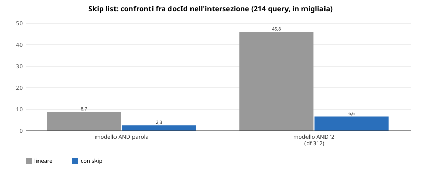
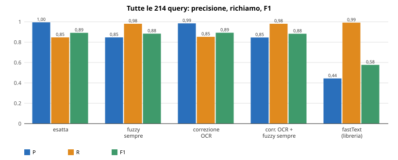
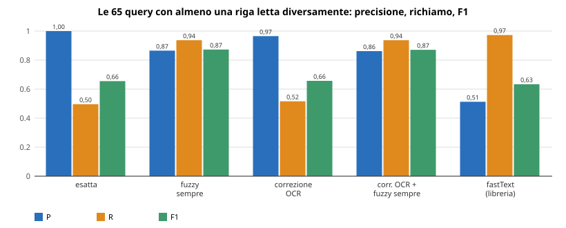

# Archivio Bolle — relazione

Complemento all'esame di Information Retrieval (laurea magistrale in Computer Engineering, Università di Pavia).

Tutti i numeri e gli esempi riportati sono prodotti dal codice del repository: `ir.Benchmark` (`data/risultati_benchmark.txt`), `ir.Esempi`, `ir.Compressione`, `ir.ValutaCorrezione`. I comandi per riprodurli sono al §12.

## 1. Obiettivo

Un sistema che cerca **articoli su bolle di trasporto (DDT) scansionate**. Una bolla è una pagina con intestazione (mittente, destinatario, numero e data) e, sotto, una riga per articolo: codice, marca, descrizione abbreviata e quantità. Il testo viene da un OCR, quindi è rumoroso:

- caratteri scambiati (`0/O`, `5/S`, `6/G`, `1/I`): nel corpus `LGE S5UR781C0LK` è il modello `55UR781C0LK` letto male;
- punteggiatura e lettere sparse (`GBBSJ21DEP_`, `i`, `|` in mezzo alla riga);
- pagine capovolte, che senza correzione producono testo illeggibile.

Un utente che cerca il codice o il modello corretto non trova le righe in cui l'OCR lo ha letto male. Il lavoro è concentrato sulle **strutture dati e sugli algoritmi di indicizzazione e recupero**, che ho scritto io, e sul modo in cui reagiscono al rumore. Il benchmark (§9) è un complemento che misura se le scelte servono; non è il centro del lavoro.

## 2. Architettura e confine «mio / libreria»

```
scansioni (tif/pdf)
      │  OCR: Tesseract + rotazione OSD         [strumento esterno, scripts/ocr.sh]
      ▼
data/ocr/*.txt  ──►  OcrParser + CorpusBuilder  [mio]  ──►  data/corpus.tsv   data/righe_escluse.tsv
                                                              │
                                                              ▼ (una riga articolo = un documento)
                 Tokenizer ──► InvertedIndex ─────────► PostingList (skip pointers)
                                    │                         ▲
                                    ▼                         │ intersezione / unione
                              KGramIndex (trigrammi) ── wildcard, fuzzy ──► Searcher ──► Cli / WebServer
                                    ▲                         ▲
                           OcrCorrector (riscrive i termini)  │
                                                              │
                 CompressedIndex (VByte + front coding)       └── Benchmark (confronta anche fastText: libreria)
```

| Componente | File | Mio / libreria |
|---|---|---|
| OCR della scansione | `scripts/ocr.sh` | **Strumento esterno**: Tesseract (lingua `ita`, rilevamento orientamento OSD), ImageMagick (`convert`), poppler (`pdftoppm`). Lo script che li lancia è mio, i programmi no |
| Parsing OCR → righe articolo, numero e data | `ir.corpus.OcrParser` | **Mio** (solo `java.util.regex` della JDK) |
| Pulizia tracciata, `corpus.tsv`, `righe_escluse.tsv` | `ir.corpus.CorpusBuilder` | **Mio** |
| Tokenizzazione | `Tokenizer` | **Mio** |
| Indice invertito (dizionario ordinato + postings) | `InvertedIndex` | **Mio** (usa `TreeMap`/`ArrayList` della JDK come contenitori) |
| Liste di postings con skip pointers, intersezione, unione | `PostingList` | **Mio** |
| Indice a trigrammi sui termini; ricerca wildcard; ricerca fuzzy (Jaccard sui trigrammi + distanza di edit) | `KGramIndex`, `EditDistance` | **Mio** |
| Compressione: gap + variable byte, front coding | `VByte`, `FrontCodedDictionary`, `CompressedIndex` | **Mio** |
| Correzione OCR mirata | `OcrCorrector` | **Mio** |
| Motore di ricerca che compone le parti | `Searcher` | **Mio** |
| Interfaccia web minimale | `WebServer` | **Mio**, sopra il server HTTP della JDK (`com.sun.net.httpserver`); nessun framework |
| Test collection e metriche; esempi della relazione | `Benchmark`, `Esempi` | **Mio** |
| Grafici SVG della relazione | `scripts/grafici.py` | **Mio**, Python con sola libreria standard (strumento di contorno) |
| Test automatici | `src/test` | JUnit 5 (libreria, solo per i test) |
| fastText (modello di confronto) | `FastTextConfronto` | **LIBRERIA di terzi**: fastText (Facebook) tramite il wrapper Java JFastText (`com.github.vinhkhuc:jfasttext` 0.5, JNI con libreria nativa inclusa, dipendenza `org.bytedeco:javacpp`). Addestramento e vettori sono della libreria; mio è solo l'uso come espansione dei termini (§9.7) |

Nessuna libreria di indicizzazione (Lucene, SQLite FTS5 o simili) è usata nel sistema: tutti gli indici sono strutture in memoria scritte da me, e non c'è un database. L'unica libreria di terzi che entra nel codice di ricerca è fastText, e solo come termine di confronto nel benchmark: non è usata da `Searcher`, dalla riga di comando né dall'interfaccia web.

## 3. Il corpus: dalla scansione alla riga articolo

Il corpus nasce da una pipeline riproducibile a quattro passi, a partire da 134 scansioni di un solo fornitore (132 TIFF e 2 PDF, da 1 a 7 pagine ciascuna).

```
1. OCR            scansione ──► testo grezzo                       (Tesseract, strumento esterno)
2. Parsing        testo grezzo ──► righe articolo + n. e data      (OcrParser, mio)
3. Pulizia        righe scartate ──► registrate con un motivo      (CorpusBuilder, mio)
4. Output         data/corpus.tsv   data/righe_escluse.tsv
```

**Passo 1 — OCR.** Una parte delle pagine è capovolta di 180° e produce testo illeggibile (senza rotazione la prima scansione dell'elenco dava righe come `YO Ida LITTYA - L''SUIONIY VO TVGI`). Prima dell'OCR ogni pagina passa per il rilevamento di orientamento di Tesseract (OSD) e viene ruotata se serve. Il testo grezzo è in `data/ocr/`, un file per scansione, con il carattere `\f` come separatore di pagina.

**Passo 2 — Parsing.** Una riga è un articolo se ha la forma `codice MARCA descrizione… quantità`: codice di 5-7 cifre, marca di 3-4 lettere maiuscole, tolleranza al rumore OCR davanti alla riga (`|. | 944328 JBL …`, `949834 i BRON …`). Numero e data del documento si cercano nell'intestazione con una regex tollerante alla punteggiatura. I token di solo rumore (punteggiatura, `i`/`l` isolate) sono rimossi dalla descrizione.

Esempio reale, dal testo OCR di `20260126082729876`:

| Riga OCR grezza | Risultato |
|---|---|
| `DESTINATARI. DS UNGINZO 003382 Pg 1/1 21/01/2026 Vendita` | numero `003382`, data `21/01/2026` |
| `939588 LGE S5UR781C0LK TV LED 55"UHD 4K DVBT2/S2 SMART WEBOS 6` | riga articolo: codice `939588`, descrizione `LGE S5UR781C0LK TV LED 55"UHD 4K DVBT2/S2 SMART WEBOS 6` (l'OCR ha letto `S5UR…` invece di `55UR…`: il parser non corregge, è compito del §8) |
| `001519 - 078 LUOGO DI DESTINAZIONE` | esclusa, motivo `luogo_destinazione` |
| `20025 LEGNANO CORSO RICCI, 211R` | esclusa, motivo `indirizzo` |
| `Rif. citato in fatt. VEND 000906 del 21/01/2026` | esclusa, motivo `riferimento_fattura_ordine` |

**Passo 3 — Pulizia tracciata.** Nessuna riga viene cancellata in silenzio: ogni riga non articolo finisce in `data/righe_escluse.tsv` con un motivo. Un documento senza nessuna riga articolo (altro layout di fornitore) è scartato per intero e registrato.

Dalle 134 scansioni risultano 115 documenti con almeno una riga articolo e 19 documenti scartati interi (altro layout: spedizioni GLS, COOP ITALIA, righe `sku descrizione CL n PZ`). Le **righe articolo sono 1067**; le righe escluse e registrate sono 6470 (`indirizzo` 730, `riferimento_fattura_ordine` 579, `luogo_destinazione` 157, `intestazione_documento` 128, `altro` 4876: testo fisso della bolla, firme, note). In 5 documenti numero e data non sono leggibili.

**Passo 4 — Output.** `data/corpus.tsv` ha le colonne `riga_id, doc_id, numero, data, codice, descrizione`. Nel seguito **ogni riga articolo è un documento** dell'indice (1067 documenti); il testo indicizzato è «codice + descrizione».

## 4. Indice invertito

`Tokenizer` porta in minuscolo e separa sui caratteri non alfanumerici: `GBBSJ21DEP_` → `gbbsj21dep`, `2.4"TFT` → `2`, `4`, `tft`. `InvertedIndex` associa a ogni termine la lista dei docId (numero d'ordine della riga nel corpus) in cui compare.

```
dizionario ordinato (TreeMap)          postings (docId crescenti, senza duplicati)
─────────────────────────────          ───────────────────────────────────────────
  ...
  aria          ───────────────►       [16, 78, 120, 156, 235, 252, 296, 478, 513, 557, 575, 628, ...]   df = 14
  friggitrice   ───────────────►       [16, 78, 120, 235, 252, 346, 478, 513, ...]                       df = 12
  tv            ───────────────►       [0, 1, 2, 3, 38, 48, 49, 50, ...]                                 df = 135
  ...
```

I docId sono assegnati in ordine di inserimento, quindi le liste sono ordinate per costruzione, senza ordinamento a posteriori. Il corpus ha **3046 termini distinti**. Una ricerca in AND di più termini è l'intersezione delle loro liste: è l'operazione che le skip list accelerano.

## 5. Skip list

`PostingList` è un `int[]` ordinato con **skip pointers**. Per una lista di lunghezza $n$ il passo è $s = \lfloor\sqrt{n}\rfloor$: dalle posizioni $i$ multiple di $s$ si può saltare a $i+s$.

```
posizione:  0    1    2    3    4    5    6    7    8    9   10   11   12   13        n = 14, s = 3
docId:     16   78  120  156  235  252  296  478  513  557  575  628  ...
            ╰──────────►╰──────────►╰──────────►                  (skip a 3, 6, 9, ...)
```

Nell'intersezione di due liste $A$ e $B$ si tengono due indici $i, j$:

- se $A[i] = B[j]$: il docId è un risultato, si avanzano entrambi;
- se $A[i] < B[j]$: se esiste uno skip da $i$ e il docId di arrivo è ancora $\le B[j]$ si salta (ripetutamente), altrimenti si avanza di una posizione; simmetricamente per $B$.

Gli skip hanno senso quando una lista è molto più lunga dell'altra. Esempi reali sul corpus (confronti fra docId):

| Intersezione | df | Risultati | Merge lineare | Con skip |
|---|---|---|---|---|
| `aria` AND `friggitrice` | 14 e 12 | 11 | 15 | 15 |
| `8gb` AND `friggitrice` | 67 e 12 | 0 | 73 | 59 |
| `tv` AND `aria` | 135 e 14 | 0 | 143 | 101 |
| `tv` AND `8gb` | 135 e 67 | 0 | 201 | 163 |

Con liste corte (prima riga) gli skip non guadagnano nulla. Sulle 214 query del benchmark (modello AND parola) il totale scende da 8718 a 2343 confronti; con un termine molto frequente (`2`, df 312, che però è una quantità e non una parola) da 45824 a 6552. Il secondo caso è favorevole agli skip di proposito.



L'intersezione con skip dà gli stessi risultati del merge lineare (verificato con un test su 200 coppie casuali di liste). Ho contato i confronti fra docId, non i tempi di esecuzione.

## 6. Indice a trigrammi: wildcard e fuzzy

`KGramIndex` indicizza i **termini del dizionario** (non i documenti) per trigrammi, con `$` ai bordi. Ogni trigramma punta alla lista ordinata dei termini che lo contengono. Sul corpus: 3046 termini, 6069 trigrammi distinti.

```
friggitrice ──► $fr  fri  rig  igg  ggi  git  itr  tri  ric  ice  ce$        (11 trigrammi)

trigramma  ──► termini che lo contengono (ordinati)
$la        ──► lava, lavabile, lavapavimenti, lavasc, lavast, lavatrice, ... (16 termini)
lav        ──► lava, lavabile, ..., (10 termini)
ava        ──► lava, lavabile, lavapavimenti, lavasc, lavast, lavatrice     ( 6 termini)
```

Lo stesso indice serve a due ricerche, con un solo indice da mantenere.

### 6.1 Wildcard

Un pattern con `*` (qualsiasi sequenza, anche vuota) si divide in pezzi fissi; per ognuno si prendono i trigrammi (con `$` ai bordi del pattern), si intersecano le liste e i candidati si controllano col pattern vero, con un confronto diretto senza regex. Se nessun pezzo ha almeno 3 caratteri si scandisce il dizionario.

Esempio `lava*` → pattern `$lava*$` → trigrammi `$la`, `lav`, `ava` → intersezione di tre liste → 6 candidati → il controllo sul pattern li conferma tutti:

| Pattern | Termini del dizionario |
|---|---|
| `lava*` | `lava`, `lavabile`, `lavapavimenti`, `lavasc`, `lavast`, `lavatrice` |
| `*frigo*` | `frigo` |
| `sdcz5*` | `sdcz500166b35`, `sdcz50016gb15`, `sdcz50016gb35`, `sdcz50032gb`, `sdcz50032gb35` |
| `*gb35` | `sdcz50016gb35`, `sdcz50032gb35`, `sdcz60032gb35` |

La query `lava*` restituisce poi 12 righe, perché ogni termine espanso ha i propri postings e si fa l'unione.

Si noti `sdcz500166b35` nel pattern `sdcz5*`: è il codice `SDCZ50016GB35` letto con `6` al posto di `G`. Il prefisso lo trova comunque; la ricerca del termine intero corretto no.

### 6.2 Fuzzy

Per una parola $q$ non trovata (o in qualunque caso, secondo la modalità) si procede in tre passi:

1. si calcola l'insieme dei suoi trigrammi $G(q)$ e, usando le liste dell'indice, il numero di trigrammi che ogni termine $t$ del dizionario ha in comune con $q$;
2. si tengono i candidati con similarità di Jaccard $J(q,t)=\dfrac{|G(q)\cap G(t)|}{|G(q)\cup G(t)|}\ge 0{,}2$ (filtro volutamente largo e poco costoso);
3. si verifica con la distanza di edit di Levenshtein, tenendo $d(q,t)\le 1$ per parole di al più 4 lettere e $d(q,t)\le 2$ per le altre.

La distanza di edit tra $a$ e $b$ si calcola per programmazione dinamica con due righe:

$$d(i,j)=\min\Big\{\,d(i-1,j)+1,\; d(i,j-1)+1,\; d(i-1,j-1)+[a_i\neq b_j]\,\Big\},\qquad d(i,0)=i,\; d(0,j)=j$$

Esempi reali (`J` = Jaccard, `d` = distanza di edit):

| Query | Termini restituiti |
|---|---|
| `frigitrice` | `friggitrice` (J=0,75; d=1), `friggitrici` (J=0,50; d=2) |
| `lavatrise` | `lavatrice` (J=0,50; d=1) |
| `tasta` | `tast` (J=0,50; d=1), `tasto` (J=0,43; d=1), `stasti` (J=0,38; d=2) |

Per `frigitrice` i trigrammi condivisi con `friggitrice` sono 9 su 12 complessivi: $J = 9/12 = 0{,}75$.

### 6.3 Il motore di ricerca

`Searcher` compone le parti. Una query è una sequenza di parole in AND. Ogni parola $w$ si espande in un insieme di termini $E(w)$ e il risultato è

$$R(q)=\bigcap_{w\in q}\ \bigcup_{t\in E(w)} P(t)$$

dove $P(t)$ è la lista di postings di $t$. L'espansione $E(w)$ è: i termini del pattern se $w$ contiene `*`; altrimenti dipende dalla modalità fuzzy, *no* ($E(w)=\{w\}$), *solo se assente* (fuzzy solo se $w$ non è nel dizionario) o *sempre* (fuzzy anche se $w$ esiste).

| Query | Modalità | Risultati |
|---|---|---|
| `friggitrice aria` | esatta | 11 (`MELC 118340042 FRIGGITRICE AD ARIA…`, `CECO 4984 FRIGGITRICE AD ARIA…`, …) |
| `lava*` | wildcard | 12 (`…LAVAST.13COP…`, `…LAVAPAVIMENTI…`, `…LAVASC.C/FRONT…`, …) |
| `frigitrice` (errore di battitura) | fuzzy solo se assente | 14 (le righe di `friggitrice` e di `friggitrici`) |

## 7. Compressione

### 7.1 Postings: gap e variable byte

I docId crescenti si trasformano nei **gap** (il primo docId, poi le differenze); i gap sono piccoli e si scrivono con la codifica a lunghezza variabile *variable byte*: 7 bit di dato per byte, e il bit alto vale 1 sull'ultimo byte del numero.

Esempio reale, i primi 12 postings di `aria`:

| | |
|---|---|
| docId | 16, 78, 120, 156, 235, 252, 296, 478, 513, 557, 575, 628 |
| gap | 16, 62, 42, 36, 79, 17, 44, 182, 35, 44, 18, 53 |
| byte (hex) | `90 BE AA A4 CF 91 AC 36 81 A3 AC 92 B5` |
| dimensione | 13 byte invece di 48 (4 byte per docId) |

Il gap 182 non entra in 7 bit e occupa due byte (`36 81`). Un altro esempio, con numeri grandi: i gap 300, 19700, 980000 diventano `2C 82 | 74 19 81 | 20 68 BB`.

### 7.2 Dizionario: front coding a blocchi

I termini ordinati condividono spesso un prefisso col precedente. A blocchi di 8 termini, il primo è scritto intero e gli altri come (lunghezza del prefisso condiviso, suffisso). Blocco reale:

| Termine | Memorizzato come |
|---|---|
| `foto` | intero |
| `foxsblack` | (2, `xsblack`) |
| `fr` | (1, `r`) |
| `fr0301` | (2, `0301`) |
| `freddo` | (2, `eddo`) |
| `free` | (3, `e`) |
| `friggitrice` | (2, `iggitrice`) |
| `friggitrici` | (10, `i`) |

La ricerca di un termine fa una ricerca binaria sulle teste dei blocchi e poi una scansione lineare dentro il blocco. `CompressedIndex` è la versione compressa, a sola lettura, dell'intero indice: i postings si decodificano al volo in una `PostingList`. Il test verifica che termini e postings coincidano con quelli dell'indice non compresso.

| Struttura | Non compressa | Compressa | Rapporto |
|---|---|---|---|
| Postings (4 byte per docId) | 50588 byte | 16876 byte | 33% |
| Dizionario (UTF-8 + 1 byte di lunghezza per termine) | 22947 byte | 19400 byte | 85% |

I postings guadagnano molto. Il dizionario poco, perché in gran parte è fatto di codici e modelli che condividono pochi prefissi (nel blocco sopra solo `friggitrice`/`friggitrici` guadagnano davvero). Le due basi di confronto e la dimensione del blocco sono scelte mie, non ottimizzate; non ho misurato il costo in tempo della decodifica.

## 8. Correzione OCR mirata

`OcrCorrector` lavora sui **termini del dizionario** e riscrive nell'indice i termini probabilmente errati. Per ogni termine $t$:

1. si generano le varianti ottenute con al più 2 scambi fra caratteri che l'OCR confonde davvero: `0/o`, `1/i`, `5/s`, `6/g`, `8/b`, `7/t`;
2. fra le varianti già presenti nel dizionario si tiene quella con più documenti, e solo se ne ha strettamente più di $t$;
3. nell'indice $t$ viene sostituito da quella variante (i postings si uniscono).

Prudenza: si toccano solo termini di almeno 4 caratteri e non fatti di sole cifre. Una prima versione senza queste due regole produceva correzioni sbagliate come `17 → it` e `46 → 4g`. Non si fa nessuna correzione a distanza di edit generica: `4gb` e `8gb` sono prodotti diversi e non vengono mai toccati.

La tabella dei caratteri confondibili è ricavata dai dati: righe con lo stesso codice articolo, lette in modo diverso in bolle diverse. Fra le coppie lettera/cifra osservate ci sono `0/O`, `6/G`, `5/S`, `1/I`, `8/B`, `7/T`. Non tutte le coppie osservate sono nella tabella (per esempio `8/S` e `1/T` compaiono nei dati e non le ho incluse). I cambi fra due cifre (`2/4`, `3/6`…) sono i più numerosi, ma riguardano per lo più le quantità, e infatti non si correggono.

Correzioni reali (df = numero di documenti):

| Termine errato (df) | Corretto (df) |
|---|---|
| `166b` (1) | `16gb` (4) |
| `16g8` (1) | `16gb` (4) |
| `32l7` (1) | `32lt` (4) |
| `g0min` (1) | `60min` (2) |
| `s5p69k` (1) | `55p69k` (4) |
| `s0mp` (2) | `50mp` (24) |
| `sdcz600326b35` (1) | `sdcz60032gb35` (2) |
| `mwpi01w` (1) | `mwp101w` (3) |
| `1p64` (1) | `ip64` (5) |

**Valutazione.** La verità di riferimento viene dal corpus stesso: per le righe con lo stesso codice e descrizione di pari lunghezza in token, la lettura più frequente è considerata corretta. È una stima, non un'annotazione manuale. Su 3046 termini il correttore propone 22 correzioni:

| Esito | Numero |
|---|---|
| Confermate dai dati (stesso codice, lettura corretta) | 11 |
| Contraddette (`gliv → 6liv`: con ogni probabilità sbaglia il riferimento, perché `6LIV` sta per «6 livelli», ma non posso dimostrarlo) | 1 |
| Non verificabili (nessuna altra riga con lo stesso codice) | 10 |

Gli errori noti, cioè i token letti diversamente da quelli di riferimento, sono 50; il correttore ne recupera 11. Gli altri sono di altro tipo (cifre diverse, lettere cadute, `J` al posto di `I`) e il correttore non li tocca di proposito.

## 9. Valutazione sperimentale

### 9.1 Test collection

È una **ricerca dell'articolo noto**. Per ogni codice articolo presente in almeno due righe (214 codici) si costruiscono due query a partire dalla lettura più frequente della descrizione:

- **query esatta**: modello + prima parola descrittiva (per esempio `gbbsj21dep combi`);
- **query wildcard**: prefisso del modello (60% dei caratteri) seguito da `*` (per esempio `gbbsj2*`).

I documenti **rilevanti** sono tutte le righe con quel codice, comprese quelle in cui l'OCR ha letto male modello o parola. Il giudizio di rilevanza è quindi **automatico**, non manuale. In 65 query almeno una riga rilevante contiene modello o parola letti diversamente dalla lettura più frequente: è il sottoinsieme in cui si vede l'effetto dell'OCR e viene riportato a parte («con varianti»).

### 9.2 Metriche

Per una query, sia $Rel$ l'insieme dei documenti rilevanti e $Ret$ quello dei documenti restituiti, su $N=1067$ documenti:

- $TP=|Ret\cap Rel|$ (veri positivi),
- $FP=|Ret\setminus Rel|$ (falsi positivi),
- $FN=|Rel\setminus Ret|$ (falsi negativi),
- $TN=N-TP-FP-FN$ (veri negativi).

$$P=\frac{TP}{TP+FP}\qquad R=\frac{TP}{TP+FN}\qquad F_1=\frac{2PR}{P+R}\qquad \text{acc}=\frac{TP+TN}{N}$$

Se una query non restituisce nulla si pone $P=0$. I valori delle tabelle sono la **media sulle query** (macro-media). L'accuratezza è vicina a 1 per costruzione, perché quasi tutti i documenti sono veri negativi: non discrimina i sistemi e la riporto solo per completezza (è in `data/risultati_benchmark.txt`).

**Esempio svolto.** Query `gbbsj21dep combi`, codice 972441, tre righe rilevanti. Con la ricerca esatta se ne trovano due (la terza ha `GBBSI21DEP`, con `I` al posto di `J`): $TP=2$, $FP=0$, $FN=1$.

$$P=\frac{2}{2}=1{,}000\qquad R=\frac{2}{3}=0{,}667\qquad F_1=\frac{2\cdot 1\cdot 0{,}667}{1+0{,}667}=0{,}800\qquad \text{acc}=\frac{1067-0-1}{1067}=0{,}99906$$

### 9.3 Sistemi confrontati

*esatta* (solo i termini della query), *fuzzy solo se assente* e *fuzzy sempre* (§6.3), *correzione OCR* (indice ricostruito con `OcrCorrector`, ricerca esatta), la combinazione dei due, e *fastText* come confronto con libreria (espansione dei termini con i vicini nello spazio di fastText).

### 9.4 Risultati sulle query esatte

| Sistema | Set | P | R | F1 |
|---|---|---|---|---|
| esatta | tutte (214) | 0,995 | 0,847 | 0,892 |
| esatta | con varianti (65) | 1,000 | 0,496 | 0,655 |
| fuzzy solo se assente | tutte e con varianti | come esatta | come esatta | come esatta |
| fuzzy sempre | tutte | 0,847 | 0,981 | 0,884 |
| fuzzy sempre | con varianti | 0,865 | 0,937 | 0,873 |
| correzione OCR | tutte | 0,985 | 0,853 | 0,893 |
| correzione OCR | con varianti | 0,965 | 0,516 | 0,657 |
| correzione OCR + fuzzy sempre | tutte | 0,846 | 0,981 | 0,883 |
| correzione OCR + fuzzy sempre | con varianti | 0,862 | 0,937 | 0,871 |
| fastText (**libreria**) | tutte | 0,444 | 0,992 | 0,577 |
| fastText (**libreria**) | con varianti | 0,513 | 0,973 | 0,634 |





(I grafici arrotondano a due decimali; le tabelle riportano tre decimali. Il file di dati completo è `data/risultati_benchmark.txt`; i grafici si rigenerano con `python3 scripts/grafici.py`.)

### 9.5 Risultati sulle query wildcard

Sull'indice normale: P 0,860, R 0,890, F1 0,831 su tutte le query; P 0,897, R 0,638, F1 0,695 sulle 65 con varianti. Sull'indice con correzione OCR: P 0,850, R 0,890, F1 0,829 (tutte) e P 0,866, R 0,639, F1 0,688 (con varianti). La correzione non aiuta le wildcard.

### 9.6 Casi di studio

**Caso 1 — dove il fuzzy recupera.** Query `gbbsj21dep combi`, tre righe rilevanti (codice 972441):

| docId | Riga | esatta | fuzzy sempre | correzione OCR |
|---|---|---|---|---|
| 740 | `972441 LGE GBBSJ21DEP. COMBI 375LT CE.D NOFROST INV. WIFI AI MATTE B 1` | trovata | trovata | trovata |
| 699 | `972441 LGE GBBSJ21DEP_ COMBI 375LT CE.D NOFROST INV. WIFI AI MATTE B 2` | trovata | trovata | trovata |
| 940 | `972441 LGE GBBSI21DEP COMBI 375LT CE.D NOFROST INV. WIFI AI MATTE BLACK 1` | **persa** | trovata | **persa** |
| | P / R / F1 | 1,000 / 0,667 / 0,800 | 1,000 / 1,000 / 1,000 | 1,000 / 0,667 / 0,800 |

L'errore `J → I` non è nella tabella dei caratteri confondibili, quindi il correttore non lo vede; il fuzzy sì (distanza 1).

**Caso 2 — dove il fuzzy sbaglia.** Query `mq10001p minipimer`, due righe rilevanti (codice 859531). Il fuzzy «sempre» espande `mq10001p` in `mq10201m`, che dista 2 ed è un altro prodotto:

| docId | Riga | Atteso |
|---|---|---|
| 483 | `859531 BRAU MQ10001P_ MINIPIMER 450W0.6LT MULTIQUICK1 4` | sì |
| 975 | `859531 BRAU MQ10001P_ MINIPIMER 450W 0.6LT MULTIQUICK1 2` | sì |
| 14 | `859532 BRAU MQ10201M MINIPIMER 450W 0.6LT MULTIQUICK1 +ACCESSORI 4` | **no** |
| 572 | `859532 BRAU MQ10201M MINIPIMER 450W 0.6LT MULTIQUICK1 +ACCESSORI 6` | **no** |

Esatta e correzione OCR: P = R = F1 = 1,000. Fuzzy sempre: $TP=2$, $FP=2$, $FN=0$, quindi $P=0{,}500$, $R=1{,}000$, $F_1=0{,}667$, acc $=0{,}99813$. È il compromesso che si vede nei grafici: il richiamo sale perché si accettano termini vicini, la precisione scende perché alcuni sono altri prodotti.

**Caso 3 — wildcard.** Il pattern `sdcz5*` trova cinque termini, fra cui `sdcz500166b35`, che è `SDCZ50016GB35` letto con `6` al posto di `G`: il prefisso non è toccato dall'errore, quindi la ricerca con wildcard recupera una riga che la ricerca per termine intero non trova.

### 9.7 Lettura dei risultati

- **Esatta.** Precisione quasi perfetta (0,995), richiamo 0,847; sulle 65 query con righe lette diversamente il richiamo cala a 0,496: trova solo metà delle righe giuste.
- **Fuzzy «solo se assente».** Identico all'esatta: i termini delle query esistono sempre nel dizionario e il fuzzy non scatta. Serve per l'errore di battitura dell'utente, che questo benchmark non contiene.
- **Fuzzy «sempre».** Richiamo 0,981 (0,937 nelle 65) ma precisione 0,847, perché fonde prodotti con codici vicini (caso 2). F1 è praticamente quello dell'esatta (0,884 contro 0,892): cambia il compromesso, non il risultato netto.
- **Correzione OCR.** Richiamo quasi invariato (0,496 → 0,516 sulle 65) e precisione un po' più bassa (1,000 → 0,965). Quattro delle 22 correzioni non hanno nessuna riga con lo stesso codice a supporto (`1286b → 128gb`, `1p64 → ip64`, `arfoelo5 → arfoel05`, `spale → 5pale`); in due anche il codice è stato letto male, quindi una correzione plausibile può essere contata come errore dal giudizio automatico.
- **fastText (libreria, confronto).** `FastTextConfronto` addestra un modello skipgram con n-grammi di carattere (3-6) sul solo testo del corpus. Ogni termine del dizionario ha un vettore (anche quelli mai visti, dai loro n-grammi) e una parola della query si espande nei termini a coseno più alto (al massimo 5 vicini con coseno ≥ 0,9); poi si usano gli stessi postings e la stessa intersezione. Richiamo più alto (0,992) e precisione più bassa (0,444): su 1067 righe i vettori discriminano poco e molti termini vicini non sono lo stesso prodotto (`8gb`/`6gb`). I parametri sono fissati a priori e **non ottimizzati sul benchmark**: una soglia più severa sposterebbe il compromesso verso la precisione, ma non l'ho provata per non tarare il confronto sul test. Non supporta le wildcard. L'addestramento usa un solo thread, ma i risultati non sono identici tra macchine: su Windows ho ottenuto P = 0,451 e R = 0,993. Gli altri sistemi sono deterministici e hanno dato gli stessi numeri.

## 10. Interfaccia

`WebServer` mostra una barra di ricerca e due opzioni, sopra lo stesso `Searcher`. Il server è quello della JDK, la pagina HTML è generata lato server, senza JavaScript né framework; il testo dei risultati e la query sono sottoposti a escape.

Le opzioni sono la modalità fuzzy (no / solo se la parola non esiste / sempre) e l'uso dell'indice con correzione OCR. Il carattere `*` vale come jolly. `ir.Cli` offre la stessa ricerca da riga di comando (`--ocr`, `--no-fuzzy`).

## 11. Discussione e limiti

**Cosa mostrano i risultati.**

- Sul tipo di errore che dominano i dati, la ricerca esatta è un riferimento difficile da battere in F1: i metodi che cercano di recuperare le righe lette male (fuzzy sempre, correzione OCR, fastText) cambiano soprattutto l'equilibrio fra precisione e richiamo.
- Il fuzzy recupera errori che il correttore non conosce (`J/I`), ma costa falsi positivi su codici prodotto simili. La correzione OCR sbaglia meno ma recupera molto poco.
- Gli skip riducono i confronti solo con liste di lunghezza molto diversa; la compressione dei postings riduce a un terzo, quella del dizionario poco.

**Limiti.**

- Un solo fornitore e un corpus piccolo (1067 righe): i numeri mostrano un comportamento, non una prestazione generale.
- Il giudizio di rilevanza è automatico (stesso codice articolo) e il codice stesso può essere letto male; questo penalizza la precisione di ciò che corregge.
- Gli errori OCR di tipo diverso dagli scambi confondibili non sono corretti dal correttore.
- Il fuzzy «solo se assente» non parte se un errore OCR è, per caso, un'altra parola valida; la modalità «sempre» lo copre ma introduce falsi positivi.
- La quantità resta in fondo alla descrizione e non è un campo separato; con righe senza quantità non si distingue da un numero della descrizione.
- 5 documenti hanno numero e data illeggibili e una pagina (`20260703100204858`) resta capovolta anche dopo il rilevamento di orientamento.
- `CompressedIndex` non è usato da `Searcher`. Ho misurato i confronti fra docId e le dimensioni, non i tempi di esecuzione né il costo della decodifica.
- fastText è usato solo come confronto e con parametri non ottimizzati (§9.7). Il wrapper `jfasttext` è un pacchetto di terzi con libreria nativa inclusa (usata su Linux e Windows x86-64); su altre piattaforme il test corrispondente viene saltato e il benchmark non gira senza di essa.

## 12. Riproduzione

I comandi per rigenerare corpus, esempi, grafici e benchmark (Linux/macOS e Windows PowerShell) sono in `docs/RIPRODUZIONE.md`.
