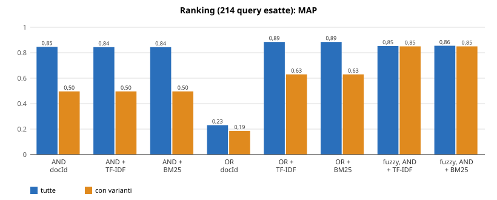

# Archivio Bolle — relazione

Complemento all'esame di Information Retrieval (laurea magistrale in Computer Engineering, Università di Pavia). Numeri ed esempi sono prodotti dal codice del repository (`ir.Benchmark`, `ir.Esempi`, `ir.Compressione`, `ir.ValutaCorrezione`, `ir.Persistenza`); i comandi per riprodurli sono in `docs/RIPRODUZIONE.md` (§13).

## 1. Obiettivo

Un sistema che cerca **articoli su bolle di trasporto (DDT) scansionate**. Ogni bolla ha un'intestazione e una riga per articolo (codice, marca, descrizione abbreviata, quantità). Il testo viene da un OCR ed è rumoroso: caratteri scambiati (`0/O`, `5/S`, `6/G`: nel corpus `LGE S5UR781C0LK` è il modello `55UR781C0LK` letto male), punteggiatura sparsa, pagine capovolte. Chi cerca il modello corretto non trova le righe lette male. Il lavoro riguarda le **strutture dati e gli algoritmi di indicizzazione e recupero**, realizzati con il supporto di un assistente IA (§14), e il loro comportamento con il rumore; il benchmark (§10) è un complemento.

## 2. Architettura e confine «mio / libreria»

```
scansioni ─ OCR (Tesseract + rotazione OSD, esterno) ─► data/ocr/*.txt ─ OcrParser/CorpusBuilder ─► data/corpus.tsv
                                                                      (una riga articolo = un documento)
Tokenizer ─► InvertedIndex ─► PostingList (skip pointers) ◄── intersezione/unione ──┐
                  │  ⇄ CompressedIndex (VByte, front coding) ⇄ data/indice.bin       │
                  └─► KGramIndex (trigrammi: wildcard, fuzzy) ──► Searcher ◄── Ranker (TF-IDF, BM25) ──► Cli / WebServer
OcrCorrector riscrive i termini dell'indice                      Benchmark confronta anche fastText (libreria)
```

| Componente | File | Mio / libreria |
|---|---|---|
| OCR | `scripts/ocr.sh` | **Strumento esterno**: Tesseract (`ita`, orientamento OSD), ImageMagick, poppler. Lo script è mio, i programmi no |
| Parsing, pulizia, `corpus.tsv` | `ir.corpus.OcrParser`, `CorpusBuilder` | **Mio** (`java.util.regex`) |
| Tokenizzazione, indice invertito, postings con skip pointers | `Tokenizer`, `InvertedIndex`, `PostingList` | **Mio** (`TreeMap`/`ArrayList` della JDK) |
| Trigrammi, wildcard, fuzzy (Jaccard + Levenshtein) | `KGramIndex`, `EditDistance` | **Mio** |
| Compressione e persistenza (VByte, front coding, file) | `VByte`, `FrontCodedDictionary`, `CompressedIndex`, `Persistenza`, `Indice` | **Mio** (`java.io`) |
| Ranking TF-IDF e BM25 | `Ranker`, `Searcher` | **Mio** |
| Correzione OCR | `OcrCorrector` | **Mio** |
| Interfaccia web e riga di comando | `WebServer`, `Cli` | **Mio**, sopra `com.sun.net.httpserver` della JDK |
| Benchmark, esempi, grafici | `Benchmark`, `Esempi`, `scripts/grafici.py` | **Mio** (grafici: Python, sola libreria standard) |
| Test automatici | `src/test` | JUnit 5 (libreria) |
| fastText (solo confronto) | `FastTextConfronto` | **LIBRERIA di terzi**: fastText (Facebook) tramite il wrapper Java `com.github.vinhkhuc:jfasttext` 0.5 (JNI, dipende da `org.bytedeco:javacpp`). Addestramento e vettori sono della libreria; mio è solo l'uso come espansione dei termini (§10.5) |

«Mio» indica ciò che non viene da librerie di terzi ed è stato realizzato nel progetto; il supporto dell'assistente IA è dichiarato al §14. Nessuna libreria di indicizzazione (Lucene, SQLite FTS5…) è usata e non c'è un database: gli indici sono strutture scritte da me, tenute in memoria durante la ricerca, con una copia salvabile su file (§7.3). fastText compare solo nel benchmark, non in `Searcher`, riga di comando o interfaccia web.

## 3. Il corpus: dalla scansione alla riga articolo

Da 134 scansioni di un solo fornitore (132 TIFF, 2 PDF, 1-7 pagine) una pipeline riproducibile produce `data/corpus.tsv`:

1. **OCR** (`scripts/ocr.sh`, esterno). Parte delle pagine è capovolta di 180° e dà testo illeggibile (`YO Ida LITTYA - L''SUIONIY VO TVGI`): prima dell'OCR ogni pagina passa per il rilevamento di orientamento di Tesseract (OSD) e viene ruotata. Testo grezzo in `data/ocr/`.
2. **Parsing** (`OcrParser`). Una riga è un articolo se ha la forma `codice MARCA descrizione… quantità` (codice di 5-7 cifre, marca di 3-4 maiuscole, rumore OCR iniziale tollerato). Numero e data si cercano nell'intestazione; i token di solo rumore sono tolti dalla descrizione.
3. **Pulizia tracciata** (`CorpusBuilder`). Ogni riga non articolo finisce in `data/righe_escluse.tsv` con un motivo; i documenti senza righe articolo (altro layout) sono scartati e registrati.

| Riga OCR grezza | Risultato |
|---|---|
| `DESTINATARI. DS UNGINZO 003382 Pg 1/1 21/01/2026 Vendita` | numero `003382`, data `21/01/2026` |
| `939588 LGE S5UR781C0LK TV LED 55"UHD 4K DVBT2/S2 SMART WEBOS 6` | riga articolo; l'errore `S5UR…` non è corretto qui (è il compito del §9) |
| `20025 LEGNANO CORSO RICCI, 211R` | esclusa, motivo `indirizzo` |

Risultato: 115 documenti con articoli, **1067 righe articolo**, 19 documenti scartati (spedizioni GLS, COOP ITALIA, righe `sku descrizione CL n PZ`), 6470 righe escluse (`indirizzo` 730, `riferimento_fattura_ordine` 579, `luogo_destinazione` 157, `intestazione_documento` 128, `altro` 4876). In 5 documenti numero e data sono illeggibili. D'ora in poi **ogni riga articolo è un documento** (1067) e il testo indicizzato è «codice + descrizione».

## 4. Indice invertito

`Tokenizer` porta in minuscolo e separa sui caratteri non alfanumerici (`GBBSJ21DEP_` → `gbbsj21dep`). `InvertedIndex` associa a ogni termine la lista dei docId in cui compare, in un dizionario ordinato (`TreeMap`); il corpus ha **3046 termini**. Per ogni termine conserva anche le frequenze (§8).

```
aria         ─► [16, 78, 120, 156, 235, 252, 296, 478, 513, 557, 575, 628, ...]   df = 14
friggitrice  ─► [16, 78, 120, 235, 252, 346, 478, 513, ...]                       df = 12
tv           ─► [0, 1, 2, 3, 38, 48, 49, 50, ...]                                 df = 135
```

I docId sono assegnati in ordine di inserimento, quindi le liste sono ordinate per costruzione. Una ricerca AND è l'intersezione delle liste.

## 5. Skip list

`PostingList` è un `int[]` ordinato con **skip pointers**: per una lista di lunghezza $n$ il passo è $s=\lfloor\sqrt{n}\rfloor$ e dalle posizioni $i$ multiple di $s$ si può saltare a $i+s$. Nell'intersezione di $A$ e $B$ si confrontano $A[i]$ e $B[j]$: se uguali il docId è un risultato; se $A[i]<B[j]$ si salta (ripetutamente) finché lo skip arriva ancora a un docId $\le B[j]$, altrimenti si avanza di uno; simmetricamente per $B$.

Gli skip servono quando una lista è molto più lunga dell'altra. Confronti fra docId su coppie reali:

| Intersezione | df | Merge lineare | Con skip |
|---|---|---|---|
| `aria` AND `friggitrice` | 14 e 12 | 15 | 15 |
| `tv` AND `aria` | 135 e 14 | 143 | 101 |
| `tv` AND `8gb` | 135 e 67 | 201 | 163 |

Sulle 214 query del benchmark (modello AND parola) i confronti scendono da 8718 a 2343; con un termine molto frequente (`2`, df 312, una quantità) da 45824 a 6552, caso favorevole di proposito. Il risultato coincide con quello del merge lineare (test su 200 coppie casuali). Ho contato i confronti, non i tempi.

## 6. Indice a trigrammi: wildcard e fuzzy

`KGramIndex` indicizza i **termini del dizionario** per trigrammi, con `$` ai bordi: `friggitrice` → `$fr fri rig igg ggi git itr tri ric ice ce$`. Ogni trigramma punta alla lista ordinata dei termini che lo contengono (6069 trigrammi distinti). Lo stesso indice serve a due ricerche.

### 6.1 Wildcard

Un pattern con `*` si divide in pezzi fissi; per ognuno si prendono i trigrammi (con `$` ai bordi del pattern), si intersecano le liste e i candidati si controllano col pattern, senza regex. Se nessun pezzo ha 3 caratteri si scandisce il dizionario. Esempio `lava*` → `$la`, `lav`, `ava` → 6 candidati, tutti confermati: `lava`, `lavabile`, `lavapavimenti`, `lavasc`, `lavast`, `lavatrice`. La query restituisce 12 righe (unione dei loro postings). Il pattern `sdcz5*` trova anche `sdcz500166b35`, cioè `SDCZ50016GB35` letto con `6` al posto di `G`, che la ricerca del termine corretto non troverebbe.

### 6.2 Fuzzy

Per una parola $q$: (1) si contano i trigrammi che ogni termine $t$ ha in comune con $q$; (2) si tengono i candidati con $J(q,t)=\dfrac{|G(q)\cap G(t)|}{|G(q)\cup G(t)|}\ge 0{,}2$, dove $G$ è l'insieme dei trigrammi (filtro largo e poco costoso); (3) si verifica con la distanza di edit di Levenshtein, tenendo $d\le 1$ per parole di al più 4 lettere e $d\le 2$ per le altre. La distanza si calcola per programmazione dinamica a due righe:

$$d(i,j)=\min\Big\{\,d(i-1,j)+1,\; d(i,j-1)+1,\; d(i-1,j-1)+[a_i\neq b_j]\,\Big\},\qquad d(i,0)=i,\; d(0,j)=j$$

Esempi reali: `frigitrice` → `friggitrice` ($J=0{,}75$ perché 9 trigrammi su 12 sono comuni; $d=1$) e `friggitrici` ($J=0{,}50$; $d=2$); `lavatrise` → `lavatrice` ($J=0{,}50$; $d=1$).

### 6.3 Il motore di ricerca

`Searcher` compone le parti. Una query è una sequenza di parole in AND; ogni parola $w$ si espande in un insieme di termini $E(w)$ (pattern per i `*`; altrimenti secondo la modalità fuzzy: *no*, *solo se la parola non è nel dizionario*, *sempre*) e

$$R(q)=\bigcap_{w\in q}\ \bigcup_{t\in E(w)} P(t)$$

dove $P(t)$ è la lista di postings di $t$. Esempi: `friggitrice aria` → 11 righe; `frigitrice` (errore di battitura, fuzzy solo se assente) → 14 righe.

## 7. Compressione e persistenza

### 7.1 Postings: gap e variable byte

I docId crescenti diventano **gap** (primo docId, poi differenze), scritti con *variable byte*: 7 bit di dato per byte, bit alto a 1 sull'ultimo byte del numero. I primi 12 postings di `aria`: docId 16, 78, 120, 156, 235, 252, 296, 478, 513, 557, 575, 628 → gap 16, 62, 42, 36, 79, 17, 44, 182, 35, 44, 18, 53 → byte `90 BE AA A4 CF 91 AC 36 81 A3 AC 92 B5`: 13 byte invece di 48 (il gap 182 occupa due byte, `36 81`).

### 7.2 Dizionario: front coding

A blocchi di 8 termini ordinati il primo è intero e gli altri sono (lunghezza del prefisso condiviso, suffisso): in un blocco reale `friggitrice` è (2, `iggitrice`) e `friggitrici` è (10, `i`). La ricerca è binaria sulle teste dei blocchi, poi lineare nel blocco.

| Struttura | Non compressa | Compressa | Rapporto |
|---|---|---|---|
| Postings (4 byte per docId) | 50588 byte | 16876 byte | 33% |
| Dizionario (UTF-8 + 1 byte di lunghezza per termine) | 22947 byte | 19400 byte | 85% |

I postings guadagnano molto; il dizionario poco, perché è fatto soprattutto di codici e modelli che condividono pochi prefissi. Basi di confronto e dimensione del blocco sono scelte mie; non ho misurato il costo della decodifica.

### 7.3 Persistenza dell'indice

Per impostazione predefinita l'indice **non è persistente**: `ir.Cli` e `ir.WebServer` rileggono `data/corpus.tsv` e lo ricostruiscono in memoria a ogni avvio. `ir.Persistenza` costruisce l'indice, lo comprime e lo salva (`data/indice.bin`, e `data/indice_ocr.bin` con la correzione OCR); `--file` lo ricarica invece di ricostruirlo. Il file contiene intestazione (numero magico e versione), testi dei documenti, dizionario con front coding, postings con gap e VByte, frequenze (VByte) e lunghezze per il ranking, offset. **L'indice a trigrammi non è salvato**: `Searcher` lo ricostruisce a ogni avvio. I test verificano che, dopo ricaricamento, termini, postings, testi, frequenze, lunghezze, ricerca e ranking siano identici all'indice in memoria, e che un file non valido sia rifiutato.

| Tempo per essere pronti a cercare | Ricostruzione da `corpus.tsv` | Caricamento da file |
|---|---|---|
| A freddo (JVM nuova, 3 prove) | 90-102 ms | 60-75 ms |
| A caldo (mediana di 20) | 17,0 ms | 5,8 ms |

`indice.bin` pesa 148810 byte, più di `corpus.tsv` (111770): contiene anche i testi non compressi (circa metà del file), frequenze e lunghezze. Il vantaggio di tempo è piccolo su 1067 documenti (la JVM e i trigrammi costano uguale nei due casi) e non so come cresca su corpora più grandi. Non ho misurato il tempo delle interrogazioni su un indice da file, dove i postings si decodificano a ogni ricerca.

## 8. Ranking: TF-IDF e BM25

Un risultato AND è un insieme elencato per docId; una ricerca che restituisce molti documenti ha bisogno di un **ordine**. L'indice conserva quindi la frequenza $tf_{t,d}$ di ogni termine in ogni documento e la lunghezza $|d|$ in token. Con $N=1067$ documenti, $df_t$ documenti che contengono $t$ e $avgdl=12{,}00$ token di lunghezza media, l'**idf** pesa di più i termini rari.

**TF-IDF** (SMART *lnc.ltn*, Manning-Raghavan-Schütze cap. 6): peso $1+\ln tf$ nel documento, normalizzato con la lunghezza euclidea del vettore; peso nella query uguale all'idf.

$$s_{\text{TF-IDF}}(d,q)=\sum_{t\in q}\frac{1+\ln tf_{t,d}}{\lVert d\rVert}\cdot\ln\frac{N}{df_t},\qquad \lVert d\rVert=\sqrt{\sum_{t\in d}\big(1+\ln tf_{t,d}\big)^2}$$

**BM25** (Robertson), idf non negativo: la frequenza *satura* e il punteggio è corretto per la lunghezza, penalizzando i documenti più lunghi della media.

$$s_{\text{BM25}}(d,q)=\sum_{t\in q}\ln\!\Big(1+\frac{N-df_t+0{,}5}{df_t+0{,}5}\Big)\cdot\frac{tf_{t,d}\,(k_1+1)}{tf_{t,d}+k_1\Big(1-b+b\,\dfrac{|d|}{avgdl}\Big)}$$

con $k_1=1{,}2$, $b=0{,}75$ (valori usuali, fissati a priori, **non ottimizzati** sul benchmark). Una parola che si espande in più termini contribuisce con la somma dei loro punteggi. `Searcher.searchRanked` ha due modalità: **AND** (il punteggio decide solo l'ordine) e **OR** (documenti con almeno una parola; il punteggio decide anche quali stanno in cima).

**Esempio.** `friggitrice aria` in OR: i termini hanno $df=12$ e $14$, idf BM25 4,448 e 4,299. La riga `892772 ARIE 4626BIANCO FRIGGITRICE AD ARIA 1300W 6LT BIANCO 2` contiene entrambi una volta e ha $|d|=10$: ogni termine vale $\frac{2{,}2}{1+1{,}2(1-0{,}75+0{,}75\cdot 10/12)}=\frac{2{,}2}{2{,}05}=1{,}073$, quindi $s=(4{,}448+4{,}299)\cdot1{,}073=9{,}387$. Le righe con $|d|=11$ valgono $9{,}056$ (TF-IDF: 2,790 e 2,660): a parità di frequenze passa avanti il documento più corto. Per `lavatrice slim`, `lavatrice` compare in un solo documento (idf 6,568) e `slim` in 28 (3,624): la riga `921711 MELI 656131. KIT CONGIUNZIONE LAVATRICE/ASCIUG. TORRE UP 2` ottiene 7,049 e precede tutte quelle con solo `slim` (circa 3,6).

## 9. Correzione OCR mirata

`OcrCorrector` riscrive nell'indice i termini probabilmente errati. Per ogni termine $t$ (di almeno 4 caratteri e non fatto di sole cifre): (1) si generano le varianti con al più 2 scambi fra caratteri che l'OCR confonde, `0/o`, `1/i`, `5/s`, `6/g`, `8/b`, `7/t`; (2) fra quelle già presenti nel dizionario si tiene quella con strettamente più documenti di $t$; (3) $t$ è sostituito da essa e i postings si uniscono. Niente correzioni a distanza di edit generica: `4gb` e `8gb` sono prodotti diversi. Senza le due restrizioni iniziali comparivano correzioni sbagliate come `17 → it`. Le coppie vengono dai dati (righe con lo stesso codice lette in modo diverso); non tutte le coppie osservate sono nella tabella (per esempio `8/S` e `1/T` no), e i cambi fra due cifre, i più numerosi, riguardano per lo più le quantità e non si correggono.

Esempi reali (df errato → df corretto): `166b`→`16gb` (1→4), `32l7`→`32lt` (1→4), `s5p69k`→`55p69k` (1→4), `s0mp`→`50mp` (2→24), `sdcz600326b35`→`sdcz60032gb35` (1→2).

**Valutazione.** La verità di riferimento viene dal corpus stesso (per righe con lo stesso codice e descrizione di pari lunghezza, la lettura più frequente è quella giusta): è una stima, non un'annotazione manuale. Il correttore propone 22 correzioni su 3046 termini: **11 confermate**, 1 contraddetta (`gliv → 6liv`: con ogni probabilità sbaglia il riferimento, perché `6LIV` sta per «6 livelli», ma non posso dimostrarlo), 10 non verificabili. Gli errori noti sono 50 e ne recupera 11; gli altri sono di altro tipo (cifre diverse, lettere cadute, `J` al posto di `I`) e non li tocca di proposito.

## 10. Valutazione sperimentale

### 10.1 Test collection e metriche

È una **ricerca dell'articolo noto**. Per ogni codice articolo presente in almeno due righe (214 codici) si hanno due query dalla lettura più frequente della descrizione: **esatta** (modello + prima parola descrittiva, es. `gbbsj21dep combi`) e **wildcard** (60% dei caratteri del modello + `*`, es. `gbbsj2*`). I documenti **rilevanti** sono tutte le righe con quel codice, comprese quelle in cui l'OCR ha letto male modello o parola. Il giudizio è quindi **automatico**, non manuale. In 65 query almeno una riga rilevante ha modello o parola letti diversamente: è il sottoinsieme «con varianti», dove si vede l'effetto dell'OCR.

Per una query, $Rel$ è l'insieme dei rilevanti, $Ret$ quello dei restituiti, $N=1067$: $TP=|Ret\cap Rel|$ (veri positivi), $FP=|Ret\setminus Rel|$ (falsi positivi), $FN=|Rel\setminus Ret|$ (falsi negativi), $TN=N-TP-FP-FN$.

$$P=\frac{TP}{TP+FP}\qquad R=\frac{TP}{TP+FN}\qquad F_1=\frac{2PR}{P+R}\qquad \text{acc}=\frac{TP+TN}{N}$$

- **Precisione** ($P$): fra i documenti restituiti, la frazione giusta; scende con le righe di altri prodotti (falsi positivi).
- **Richiamo** ($R$): fra i documenti giusti, la frazione ritrovata; scende quando righe giuste non vengono trovate, per esempio per un modello letto male (falsi negativi).
- **F1**: media armonica di $P$ e $R$; è alta solo se lo sono entrambe.
- **Accuratezza**: frazione di documenti classificati correttamente su tutti i 1067. È vicina a 1 per costruzione (quasi tutti i documenti non sono né rilevanti né restituiti), non discrimina i sistemi ed è solo in `data/risultati_benchmark.txt`.

Se una query non restituisce nulla $P=0$; le tabelle riportano la **media sulle query**. **Esempio**: `gbbsj21dep combi`, 3 righe rilevanti; la ricerca esatta ne trova 2 (la terza ha `GBBSI21DEP`): $TP=2$, $FP=0$, $FN=1$, quindi $P=\frac22=1{,}000$, $R=\frac23=0{,}667$, $F_1=\frac{2\cdot1\cdot0{,}667}{1+0{,}667}=0{,}800$, acc $=\frac{1067-1}{1067}=0{,}99906$.

### 10.2 Risultati sulle query esatte e wildcard

Sistemi: *esatta*; *fuzzy solo se assente* (§6.3); *fuzzy sempre*; *correzione OCR* (indice del §9); la combinazione; *fastText* (libreria). Wildcard: query con prefisso e `*`, su indice normale o corretto.

| Sistema | P | R | F1 | P (con varianti) | R (con varianti) | F1 (con varianti) |
|---|---|---|---|---|---|---|
| esatta | 0,995 | 0,847 | 0,892 | 1,000 | 0,496 | 0,655 |
| fuzzy solo se assente | = esatta | | | = esatta | | |
| fuzzy sempre | 0,847 | 0,981 | 0,884 | 0,865 | 0,937 | 0,873 |
| correzione OCR | 0,985 | 0,853 | 0,893 | 0,965 | 0,516 | 0,657 |
| correzione OCR + fuzzy sempre | 0,846 | 0,981 | 0,883 | 0,862 | 0,937 | 0,871 |
| fastText (**libreria**) | 0,444 | 0,992 | 0,577 | 0,513 | 0,973 | 0,634 |
| wildcard (indice normale) | 0,860 | 0,890 | 0,831 | 0,897 | 0,638 | 0,695 |
| wildcard (indice corretto) | 0,850 | 0,890 | 0,829 | 0,866 | 0,639 | 0,688 |


(I grafici arrotondano a due decimali; dati completi in `data/risultati_benchmark.txt`, grafici con `python3 scripts/grafici.py`.)

### 10.3 Casi di studio

**Il fuzzy recupera.** `gbbsj21dep combi`: la riga `972441 LGE GBBSI21DEP COMBI 375LT …` ha `I` al posto di `J`; la ricerca esatta e la correzione OCR la perdono ($P=1{,}000$, $R=0{,}667$, $F_1=0{,}800$), il fuzzy sempre la trova (3 su 3). L'errore `J/I` non è nella tabella del §9.

**Il fuzzy sbaglia.** `mq10001p minipimer` (2 righe rilevanti): il fuzzy sempre espande `mq10001p` in `mq10201m` ($d=2$), un altro prodotto con 2 righe: $TP=2$, $FP=2$, $FN=0$, $P=0{,}500$, $R=1{,}000$, $F_1=0{,}667$. Esatta e correzione OCR: tutto 1,000.

### 10.4 Risultati sul ranking

Qui conta l'**ordine**. Con $r_k\in\{0,1\}$ la rilevanza in posizione $k$ e $P@k$ la precisione sui primi $k$:

$$AP(q)=\frac{1}{|Rel|}\sum_{k=1}^{n}P@k\cdot r_k\qquad MAP=\frac{1}{|Q|}\sum_{q\in Q}AP(q)$$

**AP** premia chi mette i documenti giusti in testa (i rilevanti non restituiti valgono 0, quindi un richiamo basso abbassa la MAP); **MAP** ne è la media; **P@1** è la frazione di query con il primo risultato rilevante; **R-precision** è la frazione di rilevanti fra i primi $|Rel|$.

| Sistema | MAP | P@1 | R-prec. | MAP (con varianti) |
|---|---|---|---|---|
| AND, nessun punteggio (docId) | 0,846 | 1,000 | 0,845 | 0,496 |
| AND + TF-IDF / BM25 | 0,844 | 0,995 | 0,842 | 0,496 |
| OR, nessun punteggio (docId) | 0,231 | 0,150 | 0,142 | 0,186 |
| OR + TF-IDF / BM25 | 0,885 | 0,995 | 0,864 | 0,630 |
| fuzzy sempre, AND + TF-IDF | 0,853 | 0,757 | 0,816 | 0,850 |
| fuzzy sempre, AND + BM25 | 0,855 | 0,762 | 0,819 | 0,850 |



- **AND**: il punteggio cambia quasi nulla perché l'insieme è già quasi tutto rilevante ($P=0{,}995$); la MAP è di pochissimo più bassa (0,844 contro 0,846), troppo poco per dire che peggiori.
- **OR**: il punteggio è indispensabile (MAP da 0,231 a 0,885) e sulle query con varianti l'OR ordinato supera l'AND (0,630 contro 0,496), perché recupera righe con una sola parola corretta.
- **TF-IDF e BM25** danno gli stessi valori (differenza solo nel fuzzy: P@1 0,757 contro 0,762). Una spiegazione ragionevole, non verificata su altri corpora: le descrizioni sono corte e solo 150 coppie termine-documento su 12647 (1,2%) hanno $tf>1$, quindi decide l'idf.
- **Fuzzy sempre**: P@1 scende a 0,76; ipotesi, non verificata: le varianti errate (rare) hanno idf più alto del termine corretto e passano avanti.

### 10.5 fastText (libreria, solo confronto)

`FastTextConfronto` addestra un modello skipgram con n-grammi di carattere (3-6) sul solo testo del corpus; ogni termine del dizionario ha un vettore (anche quelli mai visti, dai loro n-grammi) e una parola della query si espande nei termini a coseno più alto (al massimo 5 vicini con coseno ≥ 0,9). Ha il richiamo più alto (0,992) e la precisione più bassa (0,444): su 1067 righe i vettori discriminano poco e molti vicini non sono lo stesso prodotto (`8gb`/`6gb`). Parametri fissati a priori e **non ottimizzati sul benchmark**: una soglia più severa sposterebbe il compromesso verso la precisione, ma non l'ho provata per non tarare il confronto sul test. Non supporta le wildcard. L'addestramento usa un thread, ma i risultati non sono identici tra macchine (su Windows ho ottenuto P = 0,451 e R = 0,993); gli altri sistemi sono deterministici.

## 11. Interfaccia

`WebServer` mostra una barra di ricerca sopra lo stesso `Searcher` (server della JDK, HTML lato server, senza JavaScript né framework, con escape di query e risultati). Opzioni: modalità fuzzy, correzione OCR, ordinamento (nessun punteggio / TF-IDF / BM25), OR; `*` vale come jolly. `ir.Cli` offre la stessa ricerca (`--ocr`, `--no-fuzzy`, `--tfidf`, `--bm25`, `--or`); entrambi accettano `--file` per caricare l'indice persistente (§7.3).

## 12. Discussione e limiti

- La ricerca esatta è difficile da battere in F1: fuzzy sempre, correzione OCR e fastText spostano soprattutto l'equilibrio fra precisione e richiamo. Il fuzzy recupera errori che il correttore non conosce (`J/I`) ma costa falsi positivi su codici simili; la correzione sbaglia meno ma recupera poco.
- Il punteggio conta soprattutto quando la ricerca restituisce molti documenti (OR); su questo corpus TF-IDF e BM25 sono indistinguibili, e non dice quale sia migliore in generale (§10.4).
- Un solo fornitore e un corpus piccolo (1067 righe): i numeri mostrano un comportamento, non una prestazione generale. La rilevanza è automatica (stesso codice) e il codice stesso può essere letto male, il che penalizza la precisione di ciò che corregge.
- Gli errori OCR diversi dagli scambi confondibili non sono corretti; il fuzzy «solo se assente» non parte se l'errore è, per caso, un'altra parola valida.
- La quantità resta in coda alla descrizione e non è un campo separato. 5 documenti hanno numero e data illeggibili e una pagina (`20260703100204858`) resta capovolta.
- L'indice è persistente solo se salvato esplicitamente (`ir.Persistenza`), a sola lettura, con i trigrammi ricostruiti a ogni avvio e testi non compressi (§7.3). Ho misurato confronti fra docId, dimensioni e tempi di avvio, non i tempi delle interrogazioni.
- fastText usa un wrapper di terzi con libreria nativa (provata su Linux e Windows x86-64); altrove il test viene saltato e il benchmark non gira.

## 13. Riproduzione

Comandi per Linux/macOS e Windows PowerShell in `docs/RIPRODUZIONE.md`.

## 14. Dichiarazione sull'utilizzo di strumenti di Intelligenza Artificiale

Nella stesura del presente progetto («Archivio Bolle», complemento all'esame di Information Retrieval) sono stati utilizzati strumenti di Intelligenza Artificiale, come richiesto dalle Linee Guida dell'Università di Pavia (Delibera CdA n. 153/2026 del 22/05/2026):

- **Strumento**: Claude (Anthropic), usato tramite Claude Code, assistente di programmazione, in sessioni su ambiente cloud. Versione del modello: [da indicare, se richiesta].
- **Perimetro**: il codice Java del sistema (parser OCR, indice invertito, skip list, trigrammi con wildcard e fuzzy, compressione, persistenza, correzione OCR, ranking TF-IDF e BM25, benchmark, interfaccia web) e i relativi test; gli script di supporto e la configurazione Maven; la bozza della relazione e della documentazione; l'esecuzione dei programmi di misura e la correzione degli errori emersi. Obiettivi e vincoli sono nel file `CLAUDE.md`, fornito dall'autore all'assistente. Le scansioni delle bolle e il testo OCR sono stati elaborati nell'ambiente di lavoro dell'assistente.
- **Modalità**: generazione di codice su indicazioni dell'autore, poi eseguito e verificato con test automatici (scritti anch'essi con l'assistente); debugging; stesura e revisione della bozza della relazione e della documentazione su richiesta dell'autore; analisi dei risultati sperimentali.
- **Altri strumenti software**: Tesseract (OCR) e fastText sono componenti usati dal sistema (§2), non strumenti usati per redigere il lavoro.

<!-- DA VERIFICARE PRIMA DI CONSEGNARE: tenere la frase seguente solo se è vera. -->
Si dichiara che tutti i contenuti generati con il supporto dell'IA sono stati criticamente verificati e rielaborati personalmente, e che l'autore si assume la piena responsabilità della correttezza e dell'originalità del lavoro presentato.

[Nome e cognome]
[Data]
